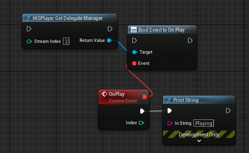

# HISPlayer API

## Public API
The following public APIs are provided by **HISPlayerTypes**.

* **enum class HISPlayerStatus**: The different status in which the stream can be settled:
  * **NONE**
  * **CLOSE**: The stream is closed.
  * **STOP**: The content is stopped.
  * **PLAY**: The content is playing.
  * **PAUSE**: The content is paused.
   
* **enum class HISPlayerLogLevel**: The different log levels. The log levels are accumulative, meaning that, when a higher log level is choosen, the logs of lower levels will also be displayed. For example: If Error level is choosen, only Error logs will be displayed. If Debug level is choosen; Debug, Info, Warning and Error messages will be displayed:
  * **DEBUG**: Logs messages useful for debugging and troubleshooting purposes, typically only visible during development.
  * **INFO**: Provides general informational messages about the application's execution.
  * **WARNING**: Indicates potential issues or situations that may require attention.
  * **ERROR**: Indicates critical errors that may prevent the application from functioning correctly.
  * **NONE** : No log messages will appear.

* **struct FHISPlayerPlaybackProperties**: Use these properties to change the playback’s behavior from the editor.
  * **bool bAutoplay**: The content will automatically play after buffering is complete.
  * **bool bLooping**: The content will automatically loop after it ends.
  * **bool bMute**: The content audio will be muted.

* **public class UDelegateManager**: Use this delegate to receive the different HISPlayer events.
  * **OnLoading**: The content starts loading.
    * **Param1**: Stream's index.
  * **OnPlay**: The content starts playing.
    * **Param1**: Stream's index.
  * **OnPause**: The content pauses.
    * **Param1**: Stream's index.
  * **OnStop**: The content stops.
    * **Param1**: Stream's index.
  * **OnEndContent**: The content ends.
    * **Param1**: Stream's index.
  * **OnTrackChanged**: The track of the stream has changed. 
    * **Param1**: Stream's index. 

## Functions
Use the following UFunctions in your blueprint or script to make your custom HISPlayer implementation.

#### static void BeginPlay(int numStreams) // HISPlayer BeginPlay
Pre-initialize HISPlayer. You must call this function on BeginPlay before the SetUp.
  * **Param1**: The number of streams to instantiate.

#### static void Setup(int streamIndex, UTexture2D*& outputTexture) // HISPlayer Setup
Initialize HISPlayer. It creates a texture in runtime internally.
  * **Param1**: Stream index.
  * **Param2**: Result texture reference.

#### static int OpenPlayer(int streamIndex, const FString& url) // HISPlayer Open Player
Start HISPlayer. A valid URL must be passed as parameter.
  * **Param1**: Stream index.
  * **Return**: 0 on success.

#### static void Update(int streamIndex) // HISPlayer Update
Update each frame, needs to be called every frame.
  * **Param1**: Stream index.

#### static void Resume(int streamIndex) // HISPlayer Resume
Resume the video.
  * **Param1**: Stream index.

#### static void Pause(int streamIndex) // HISPlayer Pause
Pause the video.
  * **Param1**: Stream index.

#### static void Stop(int streamIndex) // HISPlayer Stop
Stop the video and, next time it's played, it will begin from start.
  * **Param1**: Stream index.

#### static void Seek(int streamIndex, int msec) // HISPlayer Seek
Seeks the video to a certain position
  * **Param1**: Stream index.
  * **Param2**: Position to seek in miliseconds.

#### static void SetVolume(int streamIndex, float newVolume) // HISPlayer SetVolume
Set Playback volume.
  * **Param1**: Stream index.
  * **Param2**: Must be included in the range [0.0f, 1.0f].

#### static void SetMute(int streamIndex, bool isMute) // HISPlayer SetMute
Mute the current audio.
  * **Param1**: Stream index.
  * **Param2**: True for mute, False for unmute.

#### static int GetCurrentPosition(int streamIndex) // HISPlayer GetCurrentPosition
Returns the current time position of the current track.
  * **Param1**: Stream index.
  * **Return**: Returns the current time position of the current track in miliseconds.

#### static int GetTotalTime(int streamIndex) // HISPlayer GetTotalTime
Returns the total time of the current track.
  * **Param1**: Stream index.
  * **Return**: Returns the current time position of the current track in miliseconds.

#### static void Close(int streamIndex) // HISPlayer Close
Must be called for closing and releasing HISPlayer.
  * **Param1**: Stream index.

#### static void CreateNewTexture(int streamIndex, FIntPoint resolution, UTexture2D*& outputTexture) // HISPlayer Create New Texture 
 Create a new texture of a new resolution for a particular stream.
  * **Param1**: Stream index.
  * **Param2**: FIntPoint for resolution. X value for Width, Y value for Height.
  * **Param3**: Result texture reference.

#### static HISPlayerStatus GetPlayerStatus(int streamIndex) // HISPlayer Get Player Status
Get the current player status.
  * **Param1**: Stream index.
  * **Return**: Stream status as a HISPlayerStatus type.

#### static UDelegateManager* GetDelegateManager(int streamIndex) // HISPlayer Get Delegate Manager
Get the Delegate Manager.
  * **Param1**: Stream index.
  * **Return**: Delegate manager reference.

#### static void SetPlaybackProperties(int streamIndex, const FHISPlayerPlaybackProperties& Properties) // HISPlayer Set PlayBack Properties
Set the current playback properties of the stream. *(SDK v2.3.0 and above)*
  * **Param1**: Stream index.
  * **Param2**: PlayerPlaybackProperties type.
