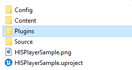
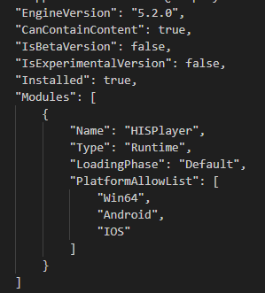

# Setup Guide
Through this guide, you will be introduced to the basic steps for setting up the playback.

## Import Package
First, extract the SDK from the .zip file, copy the **HISPlayer** folder and paste into the **Plugins/** directory in your project’s root (If that directory doesn’t exist, create one).

Then, go into the HISPlayer directory and check that the engine version in your **HISPlayer.uplugin** file is the same as your project’s Unreal version. If it's not, change the value.
The "Engine Version" field will only take into account the major and middle version number (For example, if you are using UE 5.3.2, just add 5.3.0 to that field). 
Also make sure that “IOS” is added to the PlatformAllowList field.

Open your project and go into Edit > Plugins, look for the HISPlayer plugin and if it’s disabled, enable it and restart the project.

## Set Default Build Settings Version
It is preferable to use the HISPlayer SDK in a C++ project, rather than in an only blueprint one. To create a C++ project from an only blueprint project, go to **Tools > New C++ Class** and follow the indications to create a new one. Any kind of C++ parent class will work.

For UE versions 5.0, 5.1, 5.2 and 5.3 it is necessary to set the DefaultBuildSettings to BuildSettingsVersion.V2. In order to do so, please add the line `DefaultBuildSettings = BuildSettingsVersion.V2;` in the `"YourProjectName".Target.cs` and `"YourProjectName"Editor.Target.cs` scripts, located in the `Source` directory: 

The HISPlayerSample and HISPlayerVRSample are C++ projects which already include this lines of code so, in case you are using them, you can skip to the next section.

## Import HISPlayer_Blueprint
To use HISPlayer’s functionalities in your Level, you need to add the **HISPlayer_Blueprint**. The is located inside **Content Browser > HISPlayer Content > Blueprint**.

If you can’t find the **HISPlayer Content directory** in the Content Browser, check “Show Plugin Content” in “View Options”.

Add the **HISPlayer_Blueprint**.

To render the content, you need to set an actor with **HISPlayer_Material** as Material.

You can modify the behavior of the **HISPlayer_Blueprint** as desired or use a custom blueprint, as long as it follows the original structure.

Use the **HISPlayer API** to add your own implementation.

## License Key
Input the license key that is associated with the SDK. If the license key is not valid, the player won’t work and will throw an error message. To find this field, go to the Level Outliner and look for the HISPlayer_Blueprint actor. Then, on the Details window, look for the HISPlayer section.

## Disable Anti-Aliasing
If you are experiencing a ghosting effect on the stream, then you will need to disable the anti-aliasing effect on your project. 
To do that on Unreal 5, go to **Edit > Project Settings > Engine > Rendering > Default Settings > Anti-Aliasing Method** and set it to **None**.

## Default Windows Editor RHIs
To use the SDK in the Windows Editor, make sure that the **Default RHIs** option is settled to **DirectX11** or **DirectX12**. Otherwise, go to **Edit > Project Settings > Platforms > Windows > Targeted RHIs**.

## Packaging the project
Before packaging the project, please make sure first that you are using the correct Xcode version and iOS configurations. You can check them in the [official Unreal documentation page](https://docs.unrealengine.com/5.0/en-US/ios-ipados-and-tvos-support-for-unreal-engine/). To build remotely from a Windows device, check the [official Unreal guide](https://docs.unrealengine.com/5.2/en-US/building-ios-projects-on-windows-in-unreal-engine/).

In order to package the project, you need to make sure that **Your_Project.uproject** file has been correctly updated on the **“Plugins”** field:

You can update this file manually, or by clicking on the Update button when this message appears when opening the project with the plugin installed.

## Updating the SDK

To update a HISPlayer SDK of a previous version, please follow these steps:
* Go to your Root project folder > Plugins and delete the HISPlayer folder.
* Paste your new HISPlayer SDK folder inside the Plugins folder.
* Go again to your Root project folder and delete the Binaries and Intermediate folders.
* Execute Your_Project.uproject file.

Make sure that your project is closed while doing this process.
