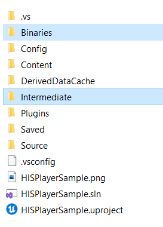
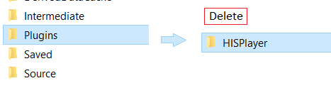
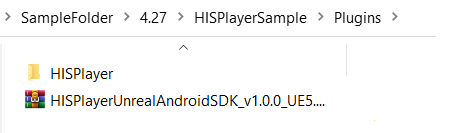

# Update the SDK

Through this guide, you will be introduced how to update the SDK if you already have installed the SDK previously.

- Go to your root project folder and delete the Binaries and Intermediate folders.
  

- Go to your root project folder > Plugins and delete the HISPlayer folder

- Paste your new HISPlayer SDK folder inside the Plugins folder.

- Execute Your_Project.uproject file.
